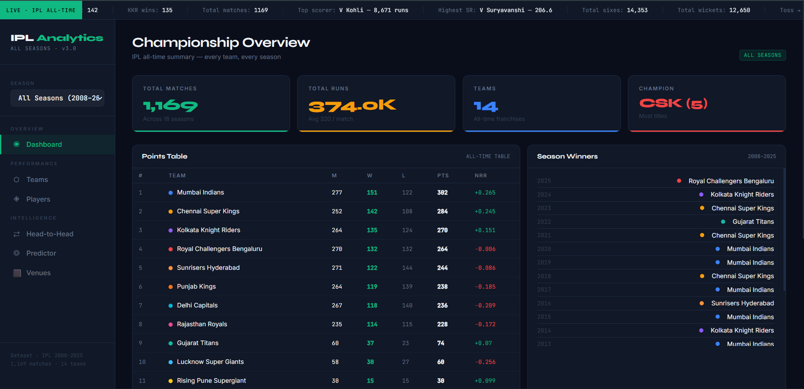
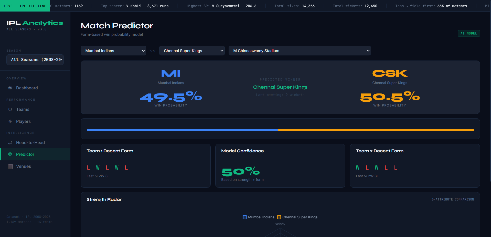

# 🏏 IPL Analytics Dashboard

A modern interactive IPL Analytics Dashboard built using historical Indian Premier League data (2008–2025). The project provides comprehensive insights into team performance, player statistics, venue analysis, championship history, head-to-head comparisons, and match outcome predictions through an intuitive sports-themed interface.

---

## 📊 Dashboard Overview

The dashboard provides an executive overview of IPL statistics including:

* Total matches played
* Total runs scored
* Number of teams
* Championship records
* Season winners
* Historical standings



---

## 📅 Year-wise Analysis

Explore IPL data season-by-season with detailed championship summaries, team standings, and season statistics.

### Key Features

* Season-specific insights
* Championship winners
* Match statistics
* Team performance tracking


---

## 🏆 Team Performance Analysis

Analyze team records across all IPL seasons.

### Features

* Team win percentages
* Wins vs losses comparison
* Historical team statistics
* Net Run Rate analysis
* Performance rankings


---

## 👑 Player Statistics

Explore individual player achievements and rankings.

### Features

* Highest run scorers
* Best strike rates
* Most Player of the Match awards
* Boundary statistics
* Batting performance analysis


---

## 🤝 Head-to-Head Analysis

Compare any two IPL teams and explore their rivalry history.

### Features

* Win distribution
* Match history
* Season-wise records
* Historical performance trends
* Venue-based results


---

## 🔮 Match Predictor

An intelligent prediction module that estimates winning probabilities using historical performance and team form.

### Features

* Team comparison
* Winning probability calculation
* Recent form analysis
* Strength radar comparison
* Model confidence score



---

## 🏟️ Venues & Toss Analysis

Analyze venue-specific trends and toss impact on match outcomes.

### Features

* Stadium statistics
* Average first innings scores
* Toss decision impact
* Venue performance matrix
* Bat-first vs chase-first analysis


---

## 📂 Project Structure

```text
IPL-Analytics-dashboard
│
├── Dashboard
│   └── ipl-dashboard.html
│
├── Images
│   ├── Dashboard.png
│   ├── Team Performance.png
│   ├── Player Statistics.png
│   ├── Head to Head.png
│   ├── Predictor.png
│   ├── Venues & Toss Analysis.png
│   └── Year wise data.png
│
├── Dataset.zip
├── .gitignore
└── README.md
```

---

## 📈 Dataset Information

The dashboard is built using IPL historical match data spanning multiple seasons.

### Dataset Includes

* Match results
* Team statistics
* Player records
* Venue information
* Toss outcomes
* Championship history

To keep the repository lightweight and GitHub-friendly, the dataset is provided in compressed format:

```text
Dataset.zip
```

Extract the dataset before running any data-dependent analysis.

---

## 🚀 Getting Started

### Clone the Repository

```bash
git clone https://github.com/PaRaG2314/IPL-Analytics-dashboard.git
```

### Navigate to Project Directory

```bash
cd IPL-Analytics-dashboard
```

### Open Dashboard

Open the following file in your browser:

```text
Dashboard/ipl-dashboard.html
```

---

## 💡 Key Insights Generated

* Most successful IPL franchises
* Championship trends across seasons
* Team win-rate comparisons
* Venue scoring patterns
* Toss influence on match outcomes
* Top-performing batsmen
* Head-to-head rivalry statistics
* Match outcome prediction analysis

---

## 🛠️ Technologies Used

* HTML5
* CSS3
* JavaScript
* Data Analytics
* Sports Data Visualization

---

## 🎯 Future Improvements

* Real-time IPL data integration
* Interactive filtering
* Player comparison engine
* Advanced predictive modeling
* Team performance forecasting
* Responsive mobile version

---

## 👨‍💻 Author

**Parag**

Computer Science Engineering Student
Aspiring Data Analyst | Python Developer | AI & ML Enthusiast

GitHub: https://github.com/PaRaG2314

---

## ⭐ Show Your Support

If you found this project useful, please consider giving it a ⭐ on GitHub.
